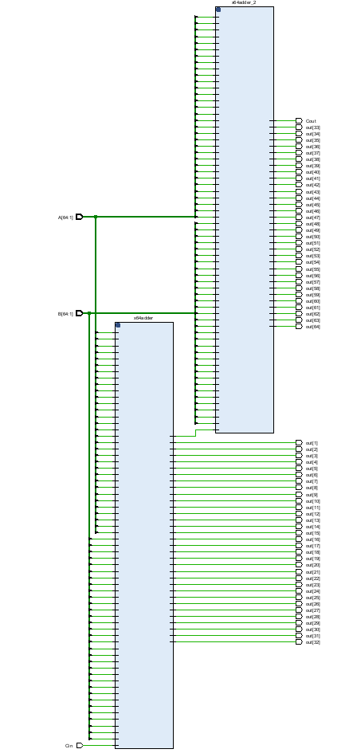
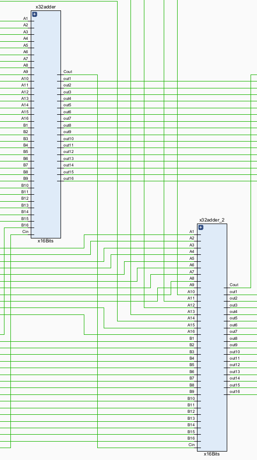
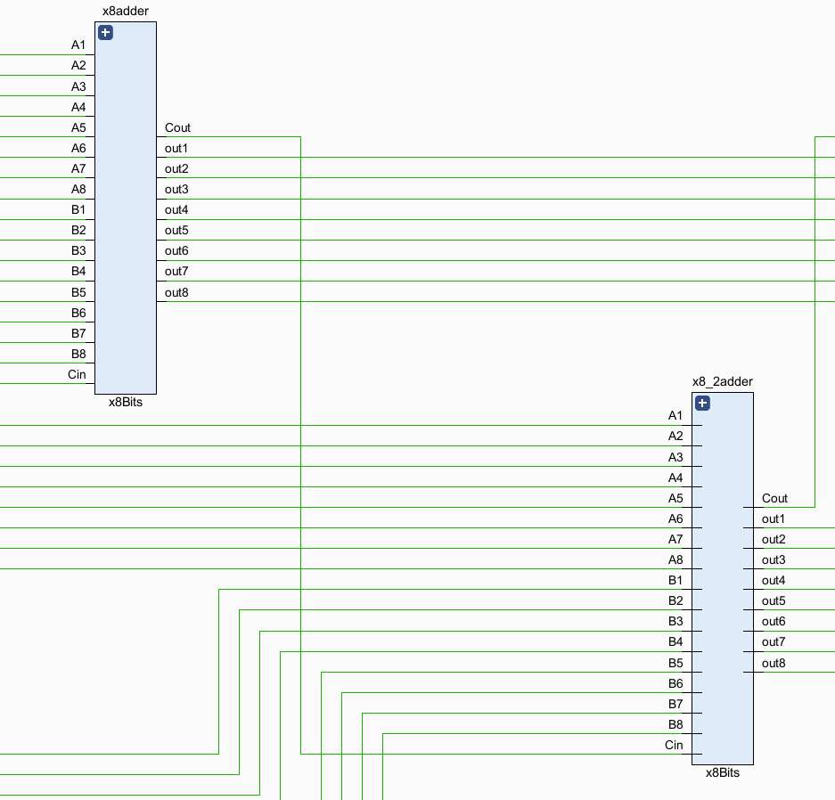
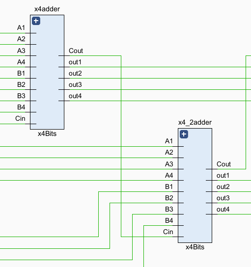
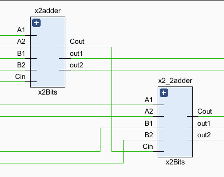
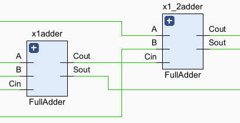
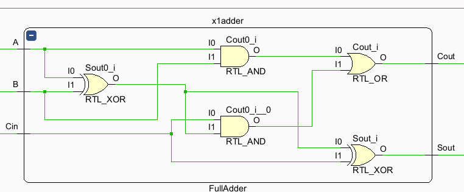
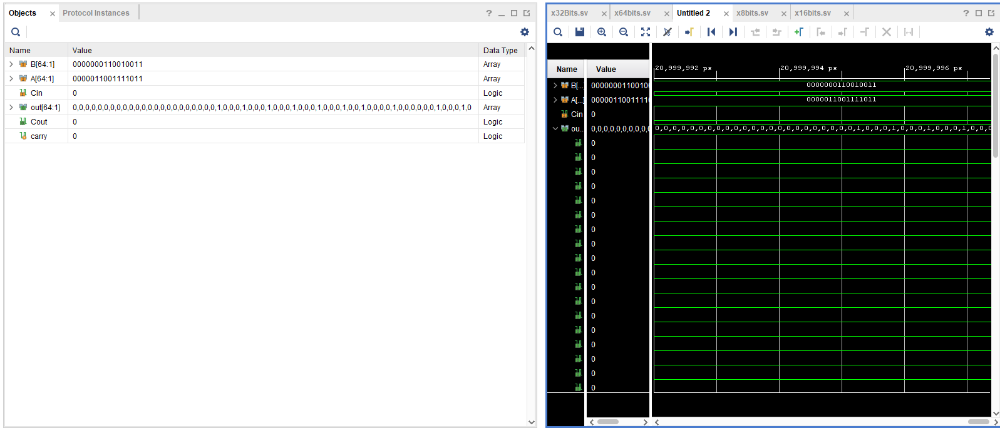

# Structural and Behavioral Modeling

## Sumador 64 bits
En este podemos ver que se crea un sumador de 64 bits utilizando la tecnica descrita en el docuemento de asignación, el cual nos dice que empecemos creando un sumador simple, luego tomemos dos de estos para crear uno de x2Bits y luego este para crear uno de x4Bits y asi sucesivamente hasta llegar a el sumador de 64 bits

En las siguientes capturas se puede ver como se cumple esta descripcion y manera de realizar el sumador de 64bits

>Podemos ver que primero tenemos dos sumadores de x32Bits para formar uno de x64bits

 
>Dentro de un sumador de x32bits podemos encontrar 2 sumadores de x16Bits

>Dentro de un sumador de x16bits podemos encontrar 2 sumadores de x8Bits

>Dentro de un sumador de x8bits podemos encontrar 2 sumadores de x4Bits

>Dentro de un sumador de x4bits podemos encontrar 2 sumadores de x2Bits

>Dentro de un sumador de x2bits podemos encontrar 2 sumadores de x1Bits

>Dentro de un sumador de x1bits podemos encontrar 1 sumador completo

## Simulacion
En esta parte se ponen a sumar los numeros:

4563468305 + 1168248999953 = 1172812468258

4563468305    = 00000000000100010000000000010000000000010001
1168248999953 = 00010001000000000001000100010001000000010001
1172812468258 = 00010001000100010001000100100001000000100010

Como podemos ver en las imagenes siguientes estas se cumple la suma tal y como se espera

